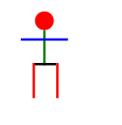

# GdmgSe Aufgabe 3

Patrick Sterk

Stefan Schmunk

## Funktion
Generierung von Formen in HTML SVG Elemente.
## M2T: Eigenschaften
- Spezialgenerator mit interner Abbildungsvorschrift
- Plattformunabhängiges Zielmodell
- Generierter und manueller Code in Übersetztungseinheit gemischt
  - Javax Document Builder für HTML Modell

### Manueller Code
```html
<!DOCTYPE html PUBLIC "-//W3C//DTD XHTML 1.0 Transitional//EN" "http://www.w3.org/TR/xhtml1/DTD/xhtml1-transitional.dtd">
<html>
<body>
<!-- Generierter Code -->
</body>
</html>
```

### Generierter Code
```html
<svg height="10" width="10">
<circle cx="2" cy="3" fill="Red" r="5"></circle>
</svg>
```
## Beispiel
### Kotlin DSL
```kotlin
val stickFigure: ShapeBuilder.() -> Unit = {
        name = "stick figure"
        x = 100
        y = 100
        rectangle {
            x = 29
            y = 18
            height = 30
            width = 2
            color = "Green"
        }
        rectangle {
            x = 10
            y = 25
            height = 2
            width = 40
            color = "Blue"
        }
        rectangle {
            x = 20
            y = 46
            height = 2
            width = 20
            color = "Black"
        }
        rectangle {
            x = 20
            y = 46
            height = 30
            width = 2
            color = "Red"
        }
        rectangle {
            x = 40
            y = 46
            height = 30
            width = 2
            color = "Red"
        }
        circle {
            x = 30
            y = 10
            radius = 8
            color = "Red"
        }
    }
```
### Zielmodell
```html
<!DOCTYPE html PUBLIC "-//W3C//DTD XHTML 1.0 Transitional//EN" "http://www.w3.org/TR/xhtml1/DTD/xhtml1-transitional.dtd">
<html>
    <body>
        <svg height="100" width="100">
            <rect fill="Green" height="30" width="2" x="29" y="18"></rect>
            <rect fill="Blue" height="2" width="40" x="10" y="25"></rect>
            <rect fill="Black" height="2" width="20" x="20" y="46"></rect>
            <rect fill="Red" height="30" width="2" x="20" y="46"></rect>
            <rect fill="Red" height="30" width="2" x="40" y="46"></rect>
            <circle cx="30" cy="10" fill="Red" r="8"></circle>
    	</svg>
    </body>
</html>
```
### Browser


### Link
https://github.com/pat-St/GdmSe_dsl_parser